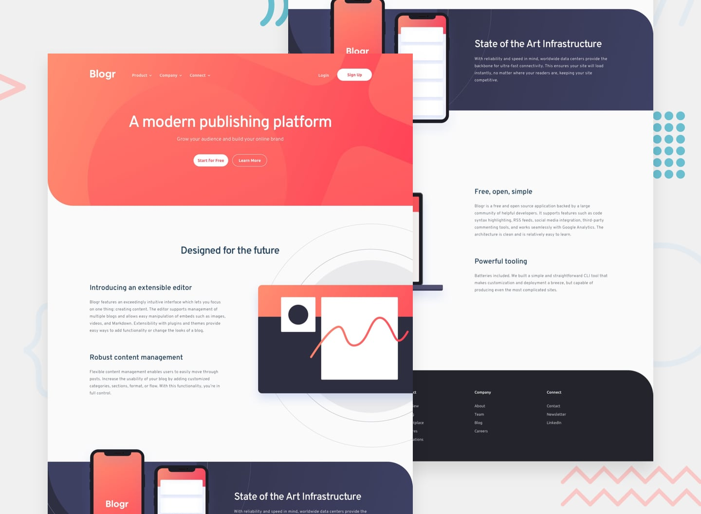

# Blogr Landing Page

A modern, responsive landing page for Blogr - a publishing platform. This project is a Frontend Mentor challenge implementation built with React, TypeScript, and Vite.



## 🚀 Features

- **Fully Responsive Design**: Optimized for mobile (375px), tablet, and desktop (1440px) viewports
- **Modern UI/UX**: Clean, modern design with smooth animations and hover effects
- **Interactive Navigation**: 
  - Desktop dropdown menus for Product, Company, and Connect
  - Mobile hamburger menu with slide-out sidebar
- **Component-Based Architecture**: Modular React components for easy maintenance
- **TypeScript**: Full type safety throughout the application
- **Performance Optimized**: Built with Vite for fast development and production builds

## 🛠️ Technologies Used

- **React 19.1.1** - UI library
- **TypeScript 5.8.3** - Type safety
- **Vite 7.1.2** - Build tool and dev server
- **CSS3** - Styling with custom properties and modern features
- **ESLint** - Code linting and quality

## 📦 Installation

1. Clone the repository:
```bash
git clone <repository-url>
cd Task-8.2--UI-Challenge
```

2. Install dependencies:
```bash
npm install
```

## 🏃 Running the Project

### Development Mode
```bash
npm run dev
```
The application will start on `http://localhost:5173`

### Build for Production
```bash
npm run build
```
The optimized build will be in the `dist` directory.

### Preview Production Build
```bash
npm run preview
```

### Linting
```bash
npm run lint
```

## 📁 Project Structure

```
Task-8.2--UI-Challenge/
├── public/                 # Static assets (images, icons)
│   ├── bg-pattern-*.svg
│   ├── illustration-*.svg
│   └── icon-*.svg
├── src/
│   ├── assets/
│   │   └── Components/     # React components
│   │       ├── Navbar/     # Navigation bar with hero section
│   │       ├── Sidebar/   # Mobile navigation menu
│   │       ├── SecondSection/  # "Designed for the future" section
│   │       ├── ThirdSection/  # "State of the Art Infrastructure" section
│   │       ├── FourthSection/  # "Free, open, simple" section
│   │       └── Footer/    # Footer with links
│   ├── App.tsx            # Main app component
│   ├── App.css            # Global styles
│   ├── main.tsx           # Application entry point
│   └── index.css          # Base styles
├── design/                # Design mockups
├── style-guide.md         # Design system specifications
├── package.json
├── vite.config.ts
└── tsconfig.json
```

## 🎨 Design Specifications

### Colors

**Primary:**
- Light red (CTA text): `hsl(356, 100%, 66%)`
- Very light red (CTA hover): `hsl(355, 100%, 74%)`
- Very dark blue (headings): `hsl(208, 49%, 24%)`

**Neutral:**
- White: `hsl(0, 0%, 100%)`
- Grayish blue (footer text): `hsl(240, 2%, 79%)`
- Very dark grayish blue (body): `hsl(207, 13%, 34%)`
- Very dark black blue (footer bg): `hsl(240, 10%, 16%)`

**Gradients:**
- Hero/CTA: `hsl(13, 100%, 72%)` → `hsl(353, 100%, 62%)`
- Body section: `hsl(237, 17%, 21%)` → `hsl(237, 23%, 32%)`

### Typography

**Fonts:**
- **Overpass**: Weights 300, 600 (Headings and body text)
- **Ubuntu**: Weights 400, 500, 700 (Navigation and buttons)

**Font Sizes:**
- Body: 16px
- Headings: Scale from 28px to 64px based on section

### Layout Breakpoints

- **Mobile**: 375px
- **Tablet**: 768px
- **Desktop**: 1440px

## 🧩 Components

### Navbar
- Desktop navigation with dropdown indicators
- Mobile hamburger menu
- Hero section with call-to-action buttons
- Gradient background with pattern overlay

### Sidebar
- Full-screen mobile navigation overlay
- Expandable menu items (Product, Company, Connect)
- Login and Sign Up buttons

### SecondSection
- "Designed for the future" content
- Two-column layout (desktop) / stacked (mobile)
- Editor illustration

### ThirdSection
- "State of the Art Infrastructure" content
- Dark gradient background
- Phone illustrations with circular pattern

### FourthSection
- "Free, open, simple" and "Powerful tooling" content
- Two-column layout with laptop illustration

### Footer
- Multi-column link layout
- Product, Company, and Connect sections
- Responsive centered layout on mobile

## 📱 Responsive Design

The application is fully responsive with breakpoints at:
- **375px**: Mobile devices
- **768px**: Tablets
- **1024px**: Small desktops
- **1440px**: Large desktops

Key responsive features:
- Mobile-first navigation with hamburger menu
- Image switching between desktop and mobile versions
- Flexible typography scaling
- Optimized spacing and padding
- Touch-friendly button sizes

## 🎯 Features Implemented

✅ Responsive layout for all screen sizes  
✅ Interactive navigation with dropdown menus  
✅ Mobile hamburger menu with sidebar  
✅ Hover states on all interactive elements  
✅ Smooth transitions and animations  
✅ Proper image optimization  
✅ Semantic HTML structure  
✅ Accessible components  
✅ TypeScript type safety  
✅ ESLint code quality  

## 📝 Scripts

- `npm run dev` - Start development server
- `npm run build` - Build for production
- `npm run preview` - Preview production build
- `npm run lint` - Run ESLint

## 🌐 Browser Support

- Chrome (latest)
- Firefox (latest)
- Safari (latest)
- Edge (latest)
\
